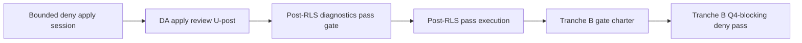

# Phase 2 RLS MAIN Deny-Posture Apply Execution Gate Owner/Security Decision Record

## Snapshot / status

| Field | Value |
|--------|--------|
| **Status** | Owner/security **MAIN deny-posture apply execution** gate — **NOT_READY_FOR_SESSION** until prerequisites below; **NOT_READY_FOR_APPLY** globally unchanged; **no** apply until adopted **and** chartered **and** prerequisites satisfied |
| **Closure label (on adoption)** | `RLS_MAIN_DENY_POSTURE_APPLY_EXECUTION_GATE_ADOPTED_BOUNDED` |
| **Scope** | **One bounded deny-posture DDL apply session** on **MAIN-OWNER-USED** (DA0–DA21); **OPTION_B** only; **Tranche B not approved** |
| **Date (UTC)** | 2026-05-19 |
| **Repository checkpoint** | `4dabff8` (or current HEAD after gate commit) |
| **Control reference** | `docs/architecture/phase-2-closure-criteria-checklist.md` — Section **U** (when logged) |

This record defines the **owner/security gate** for **one bounded deny-posture apply execution** on **MAIN-OWNER-USED** only, following adopted **deny-posture planning** (Section **T** / DP0–DP21).

It **does not** approve apply **until** this record is **adopted**, human SQL review is **PASS_REVIEWED** or **PASS_WITH_NOTES**, an **owner-held approved SQL bundle** exists, and **owner-held rollback SQL** exists.

It **does not** by itself execute SQL. Adoption authorizes **at most one** bounded apply session per approved charter — repeat requires new gate adoption or explicit amendment.

**Selected option (owner-held; binding for this gate):** **OPTION_B** — `ENABLE ROW LEVEL SECURITY` + explicit deny policies for `anon` and `authenticated` on all **seven** Phase 2 tables. **No GRANT/REVOKE** in the first apply bundle. **FORCE ROW LEVEL SECURITY** excluded.

**Current MAIN state (Q-post / R-post / S-post):** RLS **off**; FORCE **off**; **0** policies; **anon/authenticated grants present** on all **7** Phase 2 tables; aggregate rows **0**; exposure findings on all **7**; Route/PSA **WIRED_READ_PATH_UNCHECKED** unless separately verified **NOT_WIRED**.

**Adopting this record does NOT change NOT_READY_FOR_APPLY** for product apply, execution packet, Q4 operational clearance, or runtime/write. Deny posture apply on MAIN is a **narrow DDL exception** only when chartered.

**Apply execution gate adopted ≠ SQL executed ≠ deny posture verified for Q4 ≠ Tranche B approved.**

**Primary target:** **MAIN-OWNER-USED** / **PROD** (**PROD = MAIN-OWNER-USED for now**) — **only** target for this gate.

**STAGING-34B** is **not** approved for deny-posture apply by this gate. **ISOLATED-LAB** is **not** a substitute target.

This record does **not** store `project_ref`, dashboard URLs, API keys, service keys, connection strings, JWT dumps, raw child/school rows, per-school resolution maps, full grant matrices, **executable SQL bundles**, rollback SQL text, policy implementation dumps, or exact session transcripts in git. It does **not** create or change `.env` configuration.

**Readiness classification (binding for this record):**

| Classification | Meaning |
|----------------|---------|
| **NOT_READY_FOR_APPLY** | Unchanged globally — deny apply does **not** satisfy Q4, N12, compatibility pass, packet, or product apply |
| **EXECUTION_FORBIDDEN** | Default for SQL/DDL/DML/RLS except **one** bounded deny-posture apply session **after** adoption + charter + prerequisites |
| **EXECUTION_PACKET_DRAFT_FORBIDDEN** | Unchanged — N12 requires plan + snapshot evidence + **pass** |
| **DENY_POSTURE_APPLY_EXECUTION_NOT_READY** | Gate text may exist; session **forbidden** until SQL review + bundle + rollback + adoption |
| **DENY_POSTURE_APPLY_EXECUTION_APPROVED_BOUNDED** | **One** bounded OPTION_B DDL session on **MAIN-OWNER-USED** when chartered — **not** repeat without new adoption/amendment |
| **TRANCHE_B_Q4_BLOCKING_DENY_PASS_FORBIDDEN** | **Forbidden** until deny posture **applied and reviewed**, **post-RLS diagnostics pass** completed, **and** separate Tranche B gate |
| **WRITE_DENIAL_TESTS_FORBIDDEN_NOW** | Unchanged — separate future gate |
| **TIER2_DEFERRED_WITH_BOUNDED_RATIONALE** | Apply locks **empty** Phase 2 tables only; Tier 2 required before packet / Tranche B / Route / PSA / runtime-write |
| **POST_RLS_DIAGNOSTICS_PASS_FORBIDDEN_NOW** | Separate gate **after** deny apply review; **before** Tranche B |

This record does **not** close Phase 2 as a whole, does **not** authorize runtime/write, row writes, PSA, Route, operator workflow, helper/pipeline integration, Phase 3, or Phase 4 execution.

## Planning outcomes incorporated (owner-held; binding when DA adopted)

| Topic | Owner decision |
|-------|----------------|
| Option | **OPTION_B** |
| Grants | **Deny-only first apply** — no GRANT/REVOKE in bundle |
| FORCE | **Excluded** |
| Tier 2 | **TIER2_DEFERRED_WITH_BOUNDED_RATIONALE** |
| Bypass / high-privilege | **PASS_WITH_NOTES** (detail owner-held) |
| Route / PSA | **WIRED_READ_PATH_UNCHECKED** unless verified **NOT_WIRED** |
| Rollback owner | **ROLLBACK_OWNER** assigned (identity owner-held) |
| Good restored state | Q-post baseline — RLS off, FORCE off, 0 policies, grants present |
| SQL human review | **OPEN** until **SQL_REVIEWER** → `PASS_REVIEWED` or `PASS_WITH_NOTES` |
| Rollback SQL | **Required owner-held** before adoption **and** before session |

## Relationship to prior records

- **Depends on:** `docs/architecture/phase-2-rls-main-deny-posture-planning-gate-owner-decision-record.md` (DP0–DP21; Section **T**).
- **Depends on:** `docs/architecture/phase-2-rls-main-tranche-a-exposure-inventory-review-summary.md` (S-post).
- **Depends on:** `docs/architecture/phase-2-rls-main-diagnostics-pre-rls-baseline-review-summary.md` (R-post).
- **Depends on:** `docs/architecture/phase-2-rls-main-snapshot-capture-review-summary.md` (Q-post).
- **Depends on:** `docs/architecture/phase-2-rls-main-negative-test-execution-gate-owner-decision-record.md` (NT — Tranche A; Tranche B future).
- **Complements:** `docs/architecture/phase-2-rls-apply-readiness-owner-decision-record.md` (Q4).
- **Complements:** `docs/architecture/phase-2-rls-apply-preconditions-owner-decision-record.md` (C7/C9–C13).
- **Complements:** `docs/architecture/phase-2-rls-force-rls-owner-decision-record.md` (F0–F18).
- **Complements:** `docs/architecture/phase-2-rls-diagnostics-compatibility-planning-owner-decision-record.md` (D0–D20 — **post-RLS pass after deny apply review**).
- **Complements:** `docs/architecture/phase-2-rls-negative-test-plan-owner-decision-record.md` (N — Tranche B **after** post-RLS pass).
- **Complements:** `docs/architecture/phase-2-rls-sql-human-security-review-packet.md`.
- **Reference (not execution authority):** `docs/architecture/phase-2-rls-policy-sql-draft.md`.
- **Charter template (owner-held):** `docs/architecture/phase-2-rls-main-deny-posture-apply-charter-template.md` — copy before session; filled charter **not** in git by default.
- **Conflict rule:** stricter checklist, NT/S-post/DP chain, or canonical source wins; **this gate’s bounded OPTION_B apply / no-Tranche-B-until-post-RLS-pass** wins over draft SQL or speed.

## This document is not

- proof that deny posture is **applied** or **reviewed**
- SQL approval without **SQL_REVIEWER** outcome
- authority to run `phase-2-rls-policy-sql-draft.md` verbatim
- **Tranche B** execution or chartering approval
- **write-denial test** approval
- **DML** or **test row** approval
- **Q4-blocking pass** claim
- **N12 packet pass** satisfaction
- **post-RLS diagnostics pass** execution approval (separate future gate)
- **GRANT/REVOKE** approval in first bundle
- **FORCE** approval
- general Supabase connect for tests
- runtime/write, PSA, Route, Phase 3/4 approval
- storage of bundle/rollback SQL or real names in git

## Source basis

- `docs/architecture/phase-2-closure-criteria-checklist.md`
- `docs/architecture/phase-2-rls-main-deny-posture-planning-gate-owner-decision-record.md`
- `docs/architecture/phase-2-rls-main-tranche-a-exposure-inventory-review-summary.md`
- `docs/architecture/phase-2-rls-policy-sql-draft.md` (reference only)

---

## Meta-rule DA0

All **Yes** decisions (DA1–DA21) adopt **MAIN deny-posture apply execution gate** on paper and define **one bounded OPTION_B DDL apply session** on **MAIN-OWNER-USED** when prerequisites and charter are satisfied.

DA1–DA21 do **not** authorize Tranche B, write-denial tests, DML, test rows, FORCE, GRANT/REVOKE in first bundle, execution packet draft, post-RLS diagnostics **pass** execution, Gate 34B, staging apply, runtime/write, or storing secrets/SQL in git.

**Child-information protection** overrides speed for bundle review, rollback readiness, and session stop rules.

---

## Priority rule (DA21)

Stricter checklist, NT/S-post/DP chain, N plan, Q/C records, D record (diagnostics), or canonical source wins on conflict; **no Tranche B until post-RLS diagnostics pass** wins over speed; **one bounded apply session** wins over repeat without new adoption.

---

## Prerequisites before adoption (DA gate not ready until all satisfied)

| # | Prerequisite | Status at draft |
|---|--------------|-----------------|
| 1 | DP planning gate adopted (Section **T**) | expected yes at `4dabff8` |
| 2 | **OPTION_B** closed owner-held | owner-held yes |
| 3 | Human SQL review | **OPEN** → need `PASS_REVIEWED` or `PASS_WITH_NOTES` |
| 4 | **Owner-held approved SQL bundle** (seven tables; deny-only; no FORCE; no GRANT/REVOKE) | required before adoption |
| 5 | **Owner-held rollback SQL** artifact | required before adoption |
| 6 | **ROLLBACK_OWNER** assigned | owner-held |
| 7 | Tier 2 label recorded | `TIER2_DEFERRED_WITH_BOUNDED_RATIONALE` |

**Do not adopt DA0–DA21 for live session until rows 3–5 are satisfied.**

---

## Decisions DA1–DA21

| ID | Decision | Adopt? | Effect |
|----|----------|--------|--------|
| **DA1** | Adopt MAIN deny-posture **apply execution** gate (this record) | **Pending owner** | Enables chartering **one** bounded OPTION_B session when prerequisites met |
| **DA2** | Target **MAIN-OWNER-USED** only | Yes | No STAGING / lab substitute |
| **DA3** | **OPTION_B** only for this gate | Yes | RLS on + deny policies anon/auth; not Option A |
| **DA4** | **Seven** Phase 2 tables only | Yes | Names per rollout checklist / policy draft §8 |
| **DA5** | **No GRANT/REVOKE** in first apply bundle | Yes | Deny-only bundle |
| **DA6** | **FORCE** excluded | Yes | Per F-record / DP |
| **DA7** | **No DML** / test rows in session | Yes | DDL + read-only verify only |
| **DA8** | **One** apply session per adoption; repeat needs new gate/amendment | Yes | No silent re-apply |
| **DA9** | Bundle must match **SQL_REVIEWER**-approved owner-held artifact exactly | Yes | No ad-hoc SQL |
| **DA10** | **Rollback** required before session; **ROLLBACK_OWNER** assigned | Yes | Restore to Q-post good-restored-state |
| **DA11** | **Tier 2 deferred** with bounded rationale | Yes | Empty-table lock only; Tier 2 before packet/Tranche B/Route/PSA/runtime-write |
| **DA12** | **Tranche B forbidden** under this gate | Yes | Separate gate after chain below |
| **DA13** | **Write-denial tests forbidden** under this gate | Yes | Future gate |
| **DA14** | **Post-apply review** required (U-post safe summary) before claiming deny applied | Yes | Does not claim Q4 pass |
| **DA15** | **Post-RLS diagnostics pass** — separate gate; **forbidden** as part of apply session | Yes | Execute only after U-post review |
| **DA16** | **Sequencing (binding):** (1) bounded deny apply → (2) DA apply review (U-post) → (3) post-RLS diagnostics pass gate + execution → (4) **then** Tranche B gate | Yes | Tranche B **not** before step 3 pass |
| **DA17** | Route/PSA label **WIRED_READ_PATH_UNCHECKED** unless owner verifies **NOT_WIRED** | Yes | Does not block deny apply |
| **DA18** | High-privilege / bypass: **PASS_WITH_NOTES** owner-held; not product proof | Yes | N8 alignment |
| **DA19** | Role labels in git only; humans owner-held | Yes | TECH_EXECUTOR, SQL_REVIEWER, ROLLBACK_OWNER, OWNER, SECURITY_APPROVER |
| **DA20** | **NOT_READY_FOR_APPLY** unchanged; no N12 / packet / Q4 pass claim | Yes | Global apply still blocked |
| **DA21** | Priority rule (see above) | Yes | Stricter wins |

---

## Session boundary (when chartered)

**In scope:** Statements in **owner-held approved bundle** only — per table: `ENABLE ROW LEVEL SECURITY`; `CREATE POLICY` deny for `anon` and `authenticated` (OPTION_B); post-apply **read-only** catalog verification.

**Out of scope:** Tranche B; write-denial tests; INSERT/UPDATE/DELETE; test rows; FORCE; GRANT/REVOKE; tables outside seven; post-RLS diagnostics pass execution; runtime/write; Route/PSA consumption tests.

**Charter:** Use `phase-2-rls-main-deny-posture-apply-charter-template.md` (owner-held filled copy).

---

## Post-apply chain (not satisfied by apply alone)

**Tranche B** and **Q4-blocking deny pass** remain **forbidden** until **D** completes per separate owner/security records.

---

## Rollback triggers (owner-held execution)

- Failed post-apply verification
- Unexpected error during bundle
- Suspected leak / raw child data in logs or UI
- **OWNER** or **SECURITY_APPROVER** stop
- Failed downstream verification (future gates) per accountability record

Rollback artifact restores **Q-post** good-restored-state (RLS off, FORCE off, 0 policies, grants present). Details **owner-held** — not in git.

---

## Adoption sign-off (owner/security)

| Role | Decision | Date (UTC) | Notes |
|------|----------|------------|-------|
| **OWNER** | Pending / Adopted | | Prerequisites 3–5 must be satisfied before **Adopted** |
| **SECURITY_APPROVER** | Pending / Adopted | | |

**Adoption does not authorize connect** until charter approved and prerequisites confirmed on session day.

---

## Final boundary statement

This record is **apply execution gate text** for review and adoption. It **does not** execute SQL. It **does not** approve Tranche B. It **does not** clear **NOT_READY_FOR_APPLY**. **Tranche B** requires deny posture applied and reviewed, **post-RLS diagnostics pass**, and a **separate** Tranche B gate — **in that order** (DA16).

**Related:** Section **T** (planning); Section **U** (checklist — log on adoption); future **U-post** apply review safe summary; future post-RLS diagnostics pass gate.
