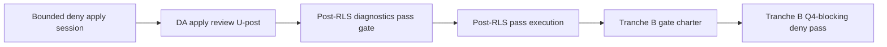

# Phase 2 RLS MAIN Deny-Posture Apply Execution Gate Owner/Security Decision Record

## Snapshot / status

| Field | Value |
|--------|--------|
| **Status** | Owner/security **MAIN deny-posture apply execution** gate adopted at **docs level** — one bounded **MAIN** Option B deny-posture apply session may occur **only** after filled **owner-held** charter approval and pre-apply check; **NOT_READY_FOR_APPLY** unchanged; Tranche B and packet remain **forbidden** |
| **Closure label** | `RLS_MAIN_DENY_POSTURE_APPLY_EXECUTION_GATE_ADOPTED_BOUNDED_DOCS_ONLY` |
| **Scope** | **One bounded deny-posture DDL apply session** on **MAIN-OWNER-USED** (DA0–DA21); **OPTION_B** only; **Tranche B not approved** |
| **Date (UTC)** | 2026-05-19 |
| **Repository checkpoint** | `6c872c1` (or current HEAD after Section **U** logging) |
| **Control reference** | `docs/architecture/phase-2-closure-criteria-checklist.md` — Section **U** (RLS MAIN deny-posture apply execution gate) |

This record **adopts DA0–DA21 at owner/security docs level** for **one bounded deny-posture apply execution** on **MAIN-OWNER-USED** only, following adopted **deny-posture planning** (Section **T** / DP0–DP21).

**SQL_REVIEWER** verdict **`PASS_WITH_NOTES`** on the owner-held Option B bundle + paired rollback artifact is **accepted** by **OWNER** / **SECURITY_APPROVER** as **`ACCEPTED_WITH_NOTES`**.

The owner-held Option B SQL bundle and paired rollback artifact are **accepted for DA adoption preparation** — **not** stored in git, **not** execution approval by themselves.

A **filled apply charter** (owner-held) is **required before any connect** or apply session.

This record **does not** run SQL. It **does not** store the SQL bundle, rollback SQL, or filled charter in git. It **does not** approve Tranche B, write-denial tests, Q4/N12 pass, execution packet, or runtime/write/PSA/Route/Phase 3/4.

**Selected option (binding):** **OPTION_B** — `ENABLE ROW LEVEL SECURITY` + explicit deny policies for `anon` and `authenticated` on all **seven** Phase 2 tables. **No GRANT/REVOKE** in the first apply bundle. **FORCE ROW LEVEL SECURITY** excluded.

**Current MAIN state (Q-post / R-post / S-post; re-verify at session):** RLS **off**; FORCE **off**; **0** policies; **anon/authenticated grants present** on all **7** Phase 2 tables; aggregate rows **0**; exposure findings on all **7**; Route/PSA **WIRED_READ_PATH_UNCHECKED** unless separately verified **NOT_WIRED**.

**DA adopted at docs level does NOT change NOT_READY_FOR_APPLY** for product apply, execution packet, Q4 operational clearance, or runtime/write.

**DA adopted at docs level ≠ SQL executed ≠ deny posture verified for Q4 ≠ Tranche B approved ≠ apply session may run without filled charter.**

**Primary target:** **MAIN-OWNER-USED** / **PROD** (**PROD = MAIN-OWNER-USED for now**) — **only** target for this gate.

**STAGING-34B** is **not** approved for deny-posture apply by this gate. **ISOLATED-LAB** is **not** a substitute target.

This record does **not** store `project_ref`, dashboard URLs, API keys, service keys, connection strings, JWT dumps, raw child/school rows, per-school resolution maps, full grant matrices, **executable SQL bundles**, rollback SQL text, policy implementation dumps, filled charter text, or exact session transcripts in git. It does **not** create or change `.env` configuration.

**Readiness classification (binding for this record):**

| Classification | Meaning |
|----------------|---------|
| **NOT_READY_FOR_APPLY** | Unchanged globally — deny apply does **not** satisfy Q4, N12, compatibility pass, packet, or product apply |
| **EXECUTION_FORBIDDEN** | Unchanged except **one** narrow path: chartered **MAIN** Option B deny-posture DDL session **after** docs-level DA adoption + **filled owner-held charter** + session-day pre-apply check |
| **EXECUTION_PACKET_DRAFT_FORBIDDEN** | Unchanged — N12 requires plan + snapshot evidence + **pass** |
| **DA_ADOPTED_DOCS_ONLY** | DA0–DA21 adopted at owner/security **docs level**; does **not** mean SQL ran or session occurred |
| **APPLY_SESSION_OPERATIONALLY_BLOCKED_UNTIL_FILLED_CHARTER** | No connect/session until filled charter **owner-held approved** |
| **OWNER_HELD_OPTION_B_BUNDLE_ACCEPTED_WITH_NOTES** | Owner-held bundle accepted for DA adoption prep; **not** in git; **not** apply approval alone |
| **OWNER_HELD_ROLLBACK_ACCEPTED_WITH_NOTES** | Owner-held rollback accepted for DA adoption prep; **not** in git |
| **DENY_POSTURE_APPLY_EXECUTION_APPROVED_BOUNDED** | **One** bounded OPTION_B DDL session on **MAIN-OWNER-USED** when chartered — repeat requires new adoption/amendment |
| **TRANCHE_B_Q4_BLOCKING_DENY_PASS_FORBIDDEN** | **Forbidden** until deny posture **applied and reviewed**, **post-RLS diagnostics pass** completed, **and** separate Tranche B gate |
| **WRITE_DENIAL_TESTS_FORBIDDEN_NOW** | Unchanged — separate future gate |
| **TIER2_DEFERRED_WITH_BOUNDED_RATIONALE** | Deny-posture apply on **empty** Phase 2 tables only; Tier 2 required before packet / Tranche B / Route / PSA / runtime-write |
| **POST_RLS_DIAGNOSTICS_PASS_SEPARATE_GATE** | Separate gate **after** deny apply review (U-post); **before** Tranche B |
| **ROUTE_PSA_WIRED_READ_PATH_UNCHECKED** | No Route/PSA pass claim from this gate |

This record does **not** close Phase 2 as a whole, does **not** authorize runtime/write, row writes, PSA, Route, operator workflow, helper/pipeline integration, Phase 3, or Phase 4 execution.

## Owner/security acceptance (OA1–OA14 summary)

| Topic | Acceptance |
|-------|------------|
| SQL_REVIEWER | `PASS_WITH_NOTES` **accepted**; mandatory notes carry into owner-held charter and U-post |
| OWNER / SECURITY_APPROVER | `ACCEPTED_WITH_NOTES` |
| Option B bundle | Owner-held **accepted**; not in git; not execution yet |
| Rollback artifact | Owner-held **accepted**; not in git |
| Filled charter | Required owner-held before connect |
| Pre-apply check | Required; mismatch = **STOP** |
| Post-apply verification | Required read-only; feeds U-post |
| Grants | Broad grants **remain**; first bundle uses RLS deny policies; no GRANT/REVOKE |
| Bypass / high-privilege | `PASS_WITH_NOTES` owner-held; **not** product proof |
| Post-RLS diagnostics | Separate gate after U-post |
| Route / PSA | `WIRED_READ_PATH_UNCHECKED`; no pass claim |
| Tier 2 | `TIER2_DEFERRED_WITH_BOUNDED_RATIONALE` for this apply only |

## Planning outcomes incorporated (owner-held; binding)

| Topic | Owner decision |
|-------|----------------|
| Option | **OPTION_B** |
| Grants | **Deny-only first apply** — no GRANT/REVOKE in bundle |
| FORCE | **Excluded** |
| Tier 2 | **TIER2_DEFERRED_WITH_BOUNDED_RATIONALE** |
| Bypass / high-privilege | **PASS_WITH_NOTES** (detail owner-held) |
| Route / PSA | **WIRED_READ_PATH_UNCHECKED** unless verified **NOT_WIRED** |
| Rollback owner | **ROLLBACK_OWNER** assigned (identity owner-held) |
| Good restored state | Q-post baseline — RLS off, FORCE off, 0 policies, grants present |
| SQL human review | **`PASS_WITH_NOTES`** accepted |
| Rollback SQL | **Accepted owner-held** (not in git) |

## Relationship to prior records

- **Depends on:** `docs/architecture/phase-2-rls-main-deny-posture-planning-gate-owner-decision-record.md` (DP0–DP21; Section **T**).
- **Depends on:** `docs/architecture/phase-2-rls-main-tranche-a-exposure-inventory-review-summary.md` (S-post).
- **Depends on:** `docs/architecture/phase-2-rls-main-diagnostics-pre-rls-baseline-review-summary.md` (R-post).
- **Depends on:** `docs/architecture/phase-2-rls-main-snapshot-capture-review-summary.md` (Q-post).
- **Depends on:** `docs/architecture/phase-2-rls-main-negative-test-execution-gate-owner-decision-record.md` (NT — Tranche A; Tranche B future).
- **Complements:** `docs/architecture/phase-2-rls-apply-readiness-owner-decision-record.md` (Q4).
- **Complements:** `docs/architecture/phase-2-rls-apply-preconditions-owner-decision-record.md` (C7/C9–C13).
- **Complements:** `docs/architecture/phase-2-rls-force-rls-owner-decision-record.md` (F0–F18).
- **Complements:** `docs/architecture/phase-2-rls-diagnostics-compatibility-planning-owner-decision-record.md` (D0–D20).
- **Complements:** `docs/architecture/phase-2-rls-negative-test-plan-owner-decision-record.md` (N).
- **Complements:** `docs/architecture/phase-2-rls-sql-human-security-review-packet.md`.
- **Reference (not execution authority):** `docs/architecture/phase-2-rls-policy-sql-draft.md`.
- **Charter template (owner-held):** `docs/architecture/phase-2-rls-main-deny-posture-apply-charter-template.md` — filled copy **not** in git.
- **Conflict rule:** stricter checklist, NT/S-post/DP chain, or canonical source wins; **no Tranche B until post-RLS diagnostics pass** wins over speed.

## This document is not

- proof that deny posture is **applied** or **operationally reviewed** (U-post is separate)
- proof that SQL **ran** on MAIN
- storage of bundle, rollback SQL, or filled charter in git
- **Tranche B** execution or chartering approval
- **write-denial test** approval
- **DML** or **test row** approval
- **Q4-blocking pass** claim
- **N12 packet pass** satisfaction
- **post-RLS diagnostics pass** execution approval (separate future gate)
- authority to connect without **filled owner-held charter**
- runtime/write, PSA, Route, Phase 3/4 approval

## Source basis

- `docs/architecture/phase-2-closure-criteria-checklist.md`
- `docs/architecture/phase-2-rls-main-deny-posture-planning-gate-owner-decision-record.md`
- `docs/architecture/phase-2-rls-main-tranche-a-exposure-inventory-review-summary.md`
- `docs/architecture/phase-2-rls-policy-sql-draft.md` (reference only)

---

## Meta-rule DA0

All **Yes** decisions (DA1–DA21) adopt **MAIN deny-posture apply execution gate** at **docs level** and define **one bounded OPTION_B DDL apply session** on **MAIN-OWNER-USED** when **filled owner-held charter** and session-day checks are satisfied.

DA1–DA21 do **not** authorize Tranche B, write-denial tests, DML, test rows, FORCE, GRANT/REVOKE in first bundle, execution packet draft, post-RLS diagnostics **pass** execution, Gate 34B, staging apply, runtime/write, or storing secrets/SQL in git.

---

## Priority rule (DA21)

Stricter checklist, NT/S-post/DP chain, N plan, Q/C records, D record (diagnostics), or canonical source wins on conflict; **no Tranche B until post-RLS diagnostics pass** wins over speed; **one bounded apply session** wins over repeat without new adoption.

---

## Prerequisites at docs-level adoption (recorded)

| # | Prerequisite | Status at adoption |
|---|--------------|-------------------|
| 1 | DP planning gate adopted (Section **T**) | **yes** |
| 2 | **OPTION_B** closed owner-held | **yes** |
| 3 | Human SQL review | **`PASS_WITH_NOTES`** accepted |
| 4 | **Owner-held Option B SQL bundle** | **accepted** (not in git) |
| 5 | **Owner-held rollback SQL** artifact | **accepted** (not in git) |
| 6 | **ROLLBACK_OWNER** assigned | owner-held |
| 7 | Tier 2 label | `TIER2_DEFERRED_WITH_BOUNDED_RATIONALE` |
| 8 | **Filled apply charter** | **required before connect** — not satisfied by this adoption alone |

**Operational session still blocked** until row 8 and session-day pre-apply check pass.

---

## Decisions DA1–DA21

| ID | Decision | Adopt? | Effect |
|----|----------|--------|--------|
| **DA1** | Adopt MAIN deny-posture **apply execution** gate (this record) at docs level | **Adopted** | DA0–DA21 logged; **not** SQL execution |
| **DA2** | Target **MAIN-OWNER-USED** only | **Adopted** | No STAGING / lab substitute |
| **DA3** | **OPTION_B** only for this gate | **Adopted** | RLS on + deny policies anon/auth |
| **DA4** | **Seven** Phase 2 tables only | **Adopted** | Seven named tables; no extras |
| **DA5** | Owner-held planning pack / SQL review prep **reviewed and accepted with notes** | **Adopted** | Deny-only; **no GRANT/REVOKE** in first bundle |
| **DA6** | **OPTION_B** selected and **accepted** by owner/security | **Adopted** | Explicit deny policies for anon/auth |
| **DA7** | **SQL_REVIEWER** `PASS_WITH_NOTES` **accepted**; mandatory notes → charter + U-post | **Adopted** | Formal bundle review closed at owner-held level |
| **DA8** | Owner-held **rollback** artifact **accepted**; filled charter **required before connect** | **Adopted** | Rollback not in git |
| **DA9** | Bundle must match SQL_REVIEWER-reviewed owner-held artifact exactly | **Adopted** | No ad-hoc SQL |
| **DA10** | **FORCE** excluded; **ROLLBACK_OWNER** assigned | **Adopted** | Per F-record / DP |
| **DA11** | **No DML** / test rows in session | **Adopted** | DDL + read-only verify only |
| **DA12** | **One** apply session per adoption; repeat needs new gate/amendment | **Adopted** | No silent re-apply |
| **DA13** | **Tier 2 deferred** with bounded rationale | **Adopted** | Tier 2 before packet/Tranche B/Route/PSA/runtime-write |
| **DA14** | **One bounded MAIN Option B** session adopted at docs level; connect requires filled charter + pre-apply check | **Adopted** | Operational block until charter |
| **DA15** | **Tranche B forbidden** under this gate | **Adopted** | Separate gate after chain below |
| **DA16** | Apply session: **no** Tranche B / **no** write-denial / **no** DML | **Adopted** | DDL deny bundle only |
| **DA17** | **Post-apply review** required; **U-post** safe summary later | **Adopted** | Does not claim Q4 pass |
| **DA18** | **Post-RLS diagnostics pass** — separate gate | **Adopted** | After U-post; before Tranche B |
| **DA19** | **No** packet / Q4 / N12 / runtime unlock from this gate | **Adopted** | Global apply still blocked |
| **DA20** | Role labels in git only; humans owner-held | **Adopted** | No secrets in git |
| **DA21** | Priority rule (see above) | **Adopted** | Stricter wins |

---

## Mandatory notes (carry into owner-held charter and U-post)

### Pre-apply check (session day; mismatch = STOP)

- Target **MAIN-OWNER-USED** / PROD confirmed.
- **0** policies on all **7** Phase 2 tables.
- **0** rows on all **7** tables.
- RLS **off**; FORCE **off** on all **7** (expected pre-state).
- **No** new triggers, views, or functions referencing the **7** tables (owner evidence: none at review time — re-check).
- Any mismatch → **STOP**; do not apply.

### Post-apply verification (read-only; owner-held)

- RLS **on** all **7**.
- FORCE **off** all **7**.
- Policy count **14** (2 per table: anon + authenticated).
- Policy names match owner-held registry.
- Rows remain **0** (if checked).
- No unexpected errors; session stayed within approved bundle.

### Program notes (unchanged by DA adoption)

- **Broad grants remain**; security for client roles relies on RLS + explicit deny policies in first bundle.
- **Bypass / high-privilege** (`PASS_WITH_NOTES` owner-held) is **not** product proof.
- **Post-RLS diagnostics pass** is a **separate** gate after U-post.
- **Route / PSA:** `WIRED_READ_PATH_UNCHECKED` — no pass claim.
- **Tier 2 defer** applies to this deny apply only; Tier 2 required before packet / Tranche B / Route / PSA / runtime-write.

---

## Session boundary (when chartered)

**In scope:** Statements in **owner-held accepted bundle** only — per table: `ENABLE ROW LEVEL SECURITY`; `CREATE POLICY` deny for `anon` and `authenticated` (OPTION_B); post-apply **read-only** catalog verification.

**Out of scope:** Tranche B; write-denial tests; INSERT/UPDATE/DELETE; test rows; FORCE; GRANT/REVOKE; tables outside seven; post-RLS diagnostics pass execution; runtime/write; Route/PSA consumption tests.

**Charter:** Use `phase-2-rls-main-deny-posture-apply-charter-template.md` (**filled copy owner-held**).

---

## Post-apply chain (not satisfied by apply alone)

**Tranche B** and **Q4-blocking deny pass** remain **forbidden** until **D** completes per separate owner/security records.

---

## Rollback triggers (owner-held execution)

- Failed post-apply verification
- Unexpected error during bundle
- Suspected leak / raw child data in logs or UI
- **OWNER** or **SECURITY_APPROVER** stop
- Failed downstream verification (future gates) per accountability record

Rollback artifact restores **Q-post** good-restored-state (RLS off, FORCE off, 0 policies, grants present). Artifact **owner-held** — **not** in git.

---

## Adoption sign-off (owner/security)

| Role | Decision | Date (UTC) | Notes |
|------|----------|------------|-------|
| **OWNER** | **Adopted** — `ACCEPTED_WITH_NOTES` | 2026-05-19 | Docs-level DA adoption only |
| **SECURITY_APPROVER** | **Adopted** — `ACCEPTED_WITH_NOTES` | 2026-05-19 | Filled charter required before connect |
| **SQL_REVIEWER** | `PASS_WITH_NOTES` (bundle + rollback) | 2026-05-19 | Mandatory notes in charter / U-post |

**Docs-level adoption does not authorize connect** until **filled owner-held charter** is approved and pre-apply check passes on session day.

---

## Final boundary statement

**DA0–DA21 are adopted at owner/security docs level** (`RLS_MAIN_DENY_POSTURE_APPLY_EXECUTION_GATE_ADOPTED_BOUNDED_DOCS_ONLY`). Apply session is documented in **U-post**; this record does **not** authorize any further apply sessions **without** a new filled charter and owner-approved gate/amendment. This **does not** approve Tranche B or write-denial tests. This **does not** claim Q4 or N12 pass. This **does not** approve packet, runtime/write, PSA, Route, Phase 3, or Phase 4. **NOT_READY_FOR_APPLY** is **unchanged**.

**Tranche B** requires deny posture applied and reviewed (U-post), **post-RLS diagnostics pass**, and a **separate** Tranche B gate — **in that order** (DA14–DA18 chain).

## U-post apply review (owner policy)

**Owner policy (2026-05-26):** MAIN Option B deny-posture apply session **completed** and post-apply verification **PASS_POST_APPLY_VERIFICATION** per `phase-2-rls-main-deny-posture-apply-review-summary.md` — RLS **on** all **7**; FORCE **off** all **7**; **14** expected policies present (2 per table); rows **all 0**; rollback **not** invoked; bundle/rollback/filled charter **owner-held** only. **Does not** approve Tranche B, write-denial tests, Q4/N12 pass, execution packet, post-RLS diagnostics pass execution, or runtime/write. **NOT_READY_FOR_APPLY** unchanged.

**Related:** Section **T** (planning); Section **U** (checklist); **U-post** — `phase-2-rls-main-deny-posture-apply-review-summary.md`; future post-RLS diagnostics pass gate.
